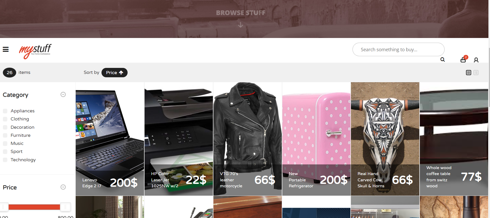

# java-ejb3-ecommerce-demo (MyStuff)
What started as my Senior year final project at the university back in 2015 turn to a full open source project after some improvements and code updates. 
This Java J2EE 7 back-end application demonstrate an online dynamic E-commerce platform where the user can add products to his cart and make order.  
It has 2 login interfaces - Admin & Customer, written in EJB 3.0 along with Hibernate and angularJs on the client side, implementing Restful Web Services (Jax-rs) and authorization/authentication for EJB Security.  

Demo can be found in the following  this link https://oren-hoffman.com/mytuff/

# Module Major Dependencies
- jboss-ejb-api_3.2
- jboss-servlet-api_3.1
- jboss-jaxrs-api_2.0

# Server Specifications
- Java Maven project
- J2EE 7
- Jboss EJB 3.0
- Persistence - Hibernate 5
- Postgresql DB

# Client Specifications
- AngularJs
- Bootstrap 4
- Respond JS
- Google+ gsi

# Environment
 - Ubuntu/Windows
 
# Requirements
- JVM
- Full application build before running
- J2EE 7+ Application Server

## Build Application
- `$ mvn clean install`

    
## Running Up Environment (After build completed)
- Deploy mystuff.war file to Application Server

## Accessing UI
- Local: http://localhost:8080/mystuff
- Demo: https://oren-hoffman.com/mystuff/

## Images

# Contact
- For any questions you can send a mail to orenhoffman1777@gmail.com
